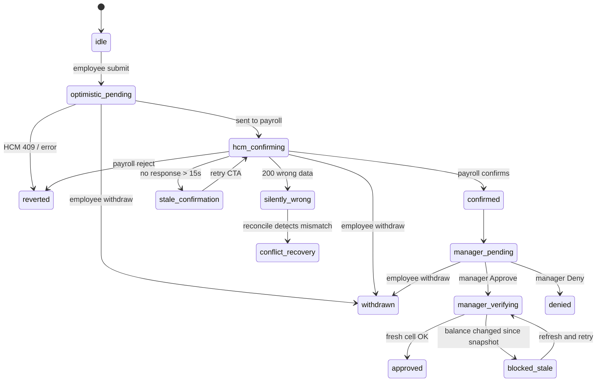
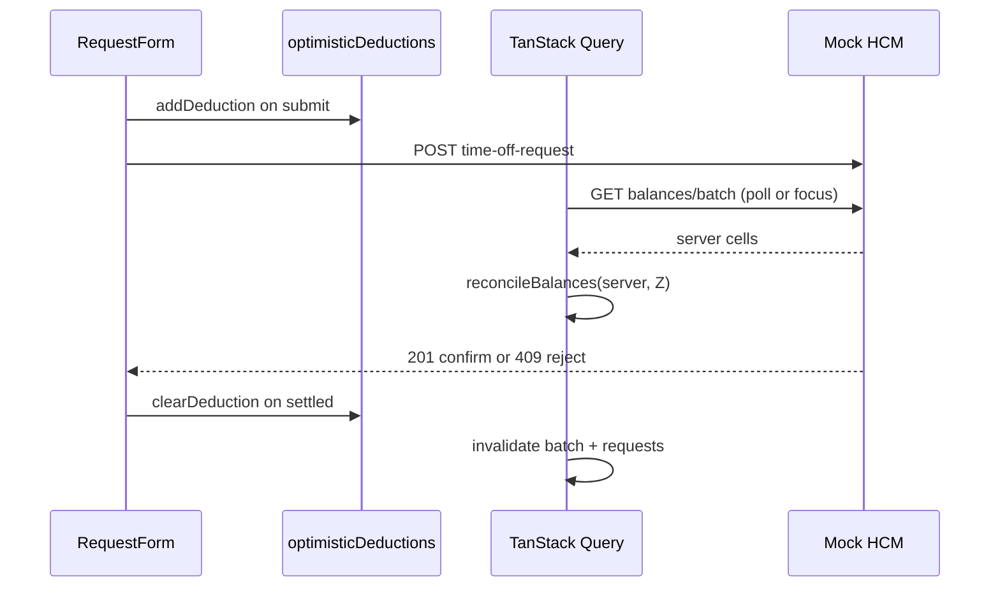

# Technical Requirements Document — ExampleHR Time-Off Frontend

**Version:** 1  
**Author:** Jorge Sarricolea  
**Status:** Implemented — see [§15 Deliverables](#15-deliverables-checklist) for artifact status

---

## Reviewer path (60 seconds)

1. **Problem** — [§1](#1-problem-statement): payroll owns numbers; ExampleHR owns honest UX.
2. **Invariant** — [§2](#2-user-guarantees): the UI may feel instant but never asserts final truth payroll has not confirmed.
3. **Decisions** — [Technology choices](#technology-choices), [§3.1 mock harness](#31-mock-hcm-test-harness), [§6](#6-optimistic-vs-pessimistic--by-action) (optimistic submit, pessimistic manager approve), [§5](#5-cache--freshness-strategy) (cache + invalidation), [§8](#8-reconciliation-rules) (merge precedence).
4. **Proof** — [§10](#10-edge-case-matrix) maps E01–E14 → tests + Storybook; run `pnpm test` and `pnpm storybook`.
5. **Demo** — [docs/demo-script.md](demo-script.md): Alex submit → Morgan approve + chaos triggers.

---

## Technology choices

Mandated by the brief: **Next.js (App Router)** and **Storybook**. Everything else is deliberate scope for a 2–3 day take-home.

| Layer | Choice | Role |
|-------|--------|------|
| Framework | Next.js 15 App Router | Routes under `app/`; mock HCM exposed as `app/api/hcm/*` route handlers in dev and production builds |
| Server state | TanStack Query v5 | Batch/cell/requests cache, mutations, polling, invalidation — see [§5](#5-cache--freshness-strategy) |
| Client UI state | Zustand | Session, drawer selection, optimistic deduction ledger only — never payroll truth — see [§5](#5-cache--freshness-strategy) |
| Validation | Zod | Request/response parsing at the HCM client boundary — see [§3](#3-hcm-api-contract) |
| UI | MUI 6 + Emotion | Layout, forms, date pickers (`@mui/x-date-pickers` + dayjs) |
| Motion | Framer Motion | Lifecycle chip / card transitions only — not layout animation |
| Mock HCM | Shared `hcm-mock` engine | One store + handlers; **Next route handlers** in the running app; **MSW** in Storybook; **direct handler imports** in Vitest contract tests — see [§3.1](#31-mock-hcm-test-harness) |
| Tests | Vitest, Storybook, Playwright | Contract tests → handlers; Storybook → MSW; E2E → Next routes — see [§11](#11-testing-strategy) |

**Rejected alternatives** (state/data): SWR, RTK Query, Zustand-as-server-cache — rationale in [§6](#6-optimistic-vs-pessimistic--by-action).

---

## 1. Problem Statement

ExampleHR provides the primary interface for employees to request time off. The Human Capital Management (HCM) system (e.g. Workday, SAP) remains the **source of truth** for employment and balance data. ExampleHR does not own the numbers — it owns the **experience**: fast feedback, honest state communication, and graceful recovery when the HCM contradicts what the UI showed moments ago.

The core tension: users expect instant UI; HCM is external, slow, batchy, occasionally silent, and mutated by events outside ExampleHR (anniversary bonuses, year-start refreshes, concurrent approvals).

---

## 2. User Guarantees

### Employee
- Sees balances per location with a visible freshness indicator.
- Gets immediate feedback on submit (optimistic), but **never** sees "Approved" until HCM confirms.
- If HCM silently returns wrong data, sees a recoverable conflict card — not a false success.
- Mid-session balance changes (anniversary) surface as a non-intrusive diff banner.

### Manager
- Reviews pending requests with balance context at decision time.
- **Freshness gate:** Approve triggers a mandatory per-cell HCM read; if balance changed since the row snapshot, approval is blocked until the manager acknowledges the diff.
- Never approves on a stale number without explicit override.

### System invariant
> The UI may feel instant, but it never asserts final truth the HCM has not confirmed.

---

## 3. HCM API Contract

Full OpenAPI spec: [`openapi/hcm.yaml`](../openapi/hcm.yaml)

| Method | Path | Purpose |
|--------|------|---------|
| GET | `/hcm/balances/batch` | Expensive full corpus — initial hydrate + periodic reconcile |
| GET | `/hcm/balances/{employeeId}/{locationId}` | Authoritative per-cell read |
| POST | `/hcm/time-off-requests` | Employee submit |
| GET | `/hcm/time-off-requests` | List (filter by status, managerId, employeeId) |
| PATCH | `/hcm/time-off-requests/{id}` | Manager approve/deny |
| DELETE | `/hcm/time-off-requests/{id}` | Employee withdraw |
| POST | `/hcm/dev/chaos` | Dev/Storybook chaos triggers |

All responses validated with Zod at the client boundary.

### 3.1 Mock HCM test harness

The brief requires mock HCM endpoints **as part of the test harness**, with enough real logic to simulate balance changes, anniversary bonuses, occasional silent-wrong success, and insufficient-balance rejection — **trivially runnable locally** so Storybook and tests can exercise the full edge-case matrix (deploy optional; see [§15](#15-deliverables-checklist)).

**One engine, three entry points** — all call the same `hcm-mock/handlers` functions:

| Consumer | Path | When used |
|----------|------|-----------|
| **Next route handlers** | `src/app/api/hcm/*` | `pnpm dev` / `pnpm start` — running app and Playwright E2E hit real HTTP |
| **MSW** | `src/hcm-mock/msw-handlers.ts` | `pnpm storybook` — no `next dev` required; global handlers in `.storybook/preview.tsx` |
| **Vitest contract tests** | `tests/integration/*` import handlers directly | `pnpm test` — same logic, no HTTP; `resetHcmState()` in `tests/setup.ts` |

In-memory state lives in `hcm-mock/store.ts` (balances, requests, chaos flags). OpenAPI documents the surface: [`openapi/hcm.yaml`](../openapi/hcm.yaml).

#### Deployed demo (Vercel serverless)

Next route handlers run on **stateless Lambdas**. Without shared storage, each `/api/hcm/*` call may see a different in-memory `Map` — symptoms include a single request row that appears to “update” instead of stack, and **withdraw 404** (`Request not found`) when DELETE hits an instance that never stored that `req-*` id.

| Environment | Mock store | Chaos / silent-wrong |
|-------------|------------|----------------------|
| `pnpm dev`, Vitest, MSW | In-process memory (default) | Full matrix (5% random + `/dev/chaos`) |
| Vercel production | **Optional Redis** when `HCM_MOCK_STORE=kv` + Upstash env vars | Random silent-wrong **off**; `/dev/chaos` returns **403** |

**Demo-only persistence (not production architecture):** When `HCM_MOCK_STORE=kv`, Next routes hydrate/persist a single JSON blob (`balances`, `requests`, `requestCounter`) via `@upstash/redis` (Vercel Redis / Upstash integration). Local tests and Storybook stay on in-memory — no Redis required for `pnpm test` / `pnpm storybook`. A real product would replace this adapter with payroll/HCM APIs and a durable backend; the UI contract is unchanged.

**Vercel setup (maintainer):** Marketplace → add **Redis** (Upstash) to the project → set `HCM_MOCK_STORE=kv` → redeploy. Blob TTL is 7 days (shared public demo resets automatically). Use **Reset demo data** on the login screen or `POST /api/hcm/dev/reset` to clear polluted shared state.

#### Brief behaviors → implementation

| Brief requirement | Mock behavior | Primary exercise |
|-------------------|---------------|------------------|
| Balance changes | Deduct on confirmed submit; manager approve/deny/withdraw update request + balance | `submit-reject.test.ts`, `demo-flow.spec.ts` (E2E), `Balances/*` stories |
| Anniversary bonus mid-session | `applyAnniversaryBonus()` via `POST /dev/chaos` `{ action: "anniversary_bonus" }` | `anniversary.test.ts` (E01), home **HCM Simulator** (dev), `Balances/MidSessionRefresh` |
| Year-start refresh | `applyYearStartRefresh()` via chaos `year_start_refresh` | Chaos panel; extends harness beyond PDF minimum |
| Silent wrong (200, wrong data) | ~5% random on POST in **non-production** (`shouldSilentWrong`, disabled under `VITEST`); deterministic via `silent_wrong_next` chaos | `silent-wrong.test.ts` (E05), `Employee/Atoms/Silently wrong` |
| Insufficient balance rejection | 409 `INSUFFICIENT_BALANCE` when `daysRequested > availableDays` | `submit-reject.test.ts` (E03), `Employee/Atoms/HCM rejected` |
| Invalid dimension | 400 `INVALID_DIMENSION` for bad employee/location/type | `invalid-dimension.test.ts` (E04) |
| Slow / timeout HCM | `delay` query param; `slow_network` chaos; 504 above threshold | `slow-hcm.test.ts`, `timeout.test.ts` (E07–E08) |
| Batch vs cell reads | `handleGetBalancesBatch` + `handleGetBalanceCell`; rate limit after N batch calls | `race-submit-batch.test.ts`, `rate-limit.test.ts` (E10, E12) |
| Manager stale approve | 409 on patch when `balanceSnapshotDays` ≠ live cell | `manager-stale.test.ts` (E06) |
| Reset between demos | `POST /dev/chaos` `{ action: "reset" }` | E2E `resetHcm`, Storybook story setup, Vitest `beforeEach` |

**Local commands (one-command harness):**

```bash
pnpm dev          # App + Next mock routes
pnpm storybook    # UI matrix via MSW
pnpm test         # Contract tests (handlers)
pnpm test:e2e     # E2E through Next routes (auto-starts dev server)
```

---

## 4. Balance Model

Balances are keyed by **cell** `(employeeId, locationId, balanceType)`. One employee may have multiple rows across locations.

- **Batch read:** Returns all cells (optionally filtered). Expensive; used on mount and every 60s background reconcile.
- **Cell read:** Authoritative for a single cell. Used before manager approval and after optimistic employee submit.

### Day counting policy

- **Unit:** business days (Monday–Friday). Weekends do **not** consume balance.
- **Range:** inclusive — both start and end dates count if they fall on a weekday.
- **Holidays:** out of scope for v1 (no holiday calendar in mock HCM).
- **UI:** `daysRequested` is derived from the date range via `countBusinessDays()`; date pickers clamp using the same rule (`maxEndDateForStart` / `minStartDateForEnd`).
- **HCM contract:** `daysRequested` in POST `/time-off-requests` is always business days; mock deducts that amount from `availableDays`.

**Example:** Fri 19 Jun → Mon 22 Jun 2026 = **2** business days (Sat/Sun excluded).

### UX principles (employee & manager)

- **Human copy** — “payroll” instead of “HCM” in user-facing text; technical terms stay in TRD/API.
- **Payroll locations** — each balance card and form option shows title + subtitle (`Austin HQ · Central office · payroll location`).
- **Status legend** — green / amber / red chips explain what “confirmed” vs “pending” means.
- **Snackbar feedback** — submit, approve, deny, and errors surface as bottom toasts (not only inline alerts).
- **Date form** — start / end / days in one row; business-day limits enforced in pickers.
- **Manager** — empty state, pending count chip, live vs snapshot balance diff inline before approve.
- **Dev tools** — HCM chaos simulator only in `development` (hidden on production home).

---

## 5. Cache & Freshness Strategy

**Library:** TanStack Query v5

| Concern | Strategy |
|---------|----------|
| Initial hydrate | `useQuery(['balances','batch', employeeId])` on employee/manager mount |
| Background reconcile | `refetchInterval: 60_000`, `refetchOnWindowFocus: true` |
| Per-cell freshness | `useQuery(['balances','cell', employeeId, locationId, balanceType])` with `staleTime: 5_000` |
| Cache keys | `['balances','batch', employeeId]`, `['balances','cell', employeeId, locationId, balanceType]`, `['requests', filters]` |
| Stale UI | Badge: "Verified {relativeTime}" on each balance card |
| Batch vs optimistic merge | Reconciliation helper merges batch results without wiping in-flight optimistic deductions |

**Why these intervals:** Batch is expensive (PDF: full corpus) → poll every **60s** plus refetch on window focus, not on every navigation. Cell read is cheap and authoritative → **5s** `staleTime` on `useBalanceCell` so manager approve reuses a recent read when possible but refetches on Approve click. Employee requests poll every **3s** only while any row is `hcm_confirming` or `stale_confirmation`; manager queue polls every **15s**.

### Mutation → cache invalidation

| Event | Optimistic layer (Zustand) | Query invalidation |
|-------|---------------------------|-------------------|
| Submit `onMutate` | `addOptimisticDeduction` for request cell | `cancelQueries` on `balances/batch` (avoid race mid-write) |
| Submit error (409/400/504) | `clearOptimisticDeduction` | same as settled |
| Submit settled (any outcome) | `clearOptimisticDeduction` | `balances/batch` + `requests` (employee) |
| Withdraw settled | — | `balances/batch` + `requests` (employee) |
| Manager approve/deny settled | — | `requests` (manager) |
| Chaos / anniversary trigger | — | all `balances` queries |
| Background batch poll | merge via `reconcileBalances` in `select` | no invalidate — server data merged with pending deductions |

Cell queries are **refetched on demand** (manager Approve calls `cellQuery.refetch()`), not bulk-invalidated on every mutation.

**Zustand** holds only ephemeral UI state (session, selected request drawer, optimistic deductions) — never balance truth.

---

## 6. Optimistic vs Pessimistic — By Action

| Action | Strategy | Rationale |
|--------|----------|-----------|
| Employee submit | **Optimistic** balance decrement + request `optimistic_pending` → `hcm_confirming` | Instant feedback; rollback on HCM reject |
| Employee withdraw | **Optimistic** queue removal | Low risk; 409 restores row |
| Manager approve | **Pessimistic gate** (fresh cell read) then optimistic queue update | Manager must not approve on stale balance |
| Manager deny | Optimistic queue update | Deny does not depend on balance |
| Batch refresh during mutation | **Merge**, not overwrite | Preserve optimistic deduction until HCM confirms |

### Alternatives considered

| Alternative | Rejected because |
|-------------|------------------|
| Pessimistic-only submit | Feels sluggish; brief asks for instant employee feedback |
| SWR | Weaker optimistic mutation/rollback ergonomics |
| RTK Query | Heavier boilerplate for 2–3 day scope |
| SSE from HCM | Out of scope; polling + focus refetch sufficient |
| Zustand for server cache | Reimplements Query poorly |

---

## 7. Request Lifecycle State Machine



Each state maps to `StatusChip` + copy + MUI color + optional Framer Motion transition.

**Stale confirmation:** If `hcm_confirming` exceeds 15s without response → `stale_confirmation` with retry CTA.

---

## 8. Reconciliation Rules

### Merge precedence (`reconcileBalances`)

When batch data and optimistic deductions overlap on the same cell `(employeeId, locationId, balanceType)`:

1. **Server cell is source of truth** for `availableDays` returned by payroll.
2. **Optimistic deduction applies only** while a matching entry exists in `optimisticDeductions` (added on submit `onMutate`, cleared on error or settled).
3. **Displayed balance** = `max(0, server.availableDays - pendingDeduction.days)` for that cell.
4. **No deduction is applied twice** — clearing Zustand on settle prevents double-subtract after HCM confirms.
5. **Batch poll does not invalidate** the batch query; it refetches and re-runs merge in the `select` function (see E10).
6. **Manager approve** uses a fresh **cell read**, not the merged batch snapshot, before committing.

### Scenario rules

1. **Batch arrives during optimistic pending:** Apply batch via `reconcileBalances(optimistic, server)` — rules above; pending request row stays until HCM resolves.
2. **Anniversary bonus mid-session:** Batch or chaos trigger increments cell; UI shows `BalanceRefreshBanner` with diff; employee form re-validates against new balance.
3. **Silent wrong (200, wrong data):** **Chaos-harness scenario** (`silent_wrong_next`), not typical production HCM behavior. Client surfaces mismatch via `hasSilentWrongConflict` → `conflict_recovery` UI (E05).
4. **Manager freshness gate:** On approve click, `refetch` cell; if `availableDays !== balanceSnapshotDays`, show `FreshnessGateModal`. Primary CTA = refresh and retry with new snapshot. Secondary **Approve anyway** = explicit manager override after acknowledging the diff (warning snackbar in UI). Payroll remains authoritative; in production this path would require audit logging — omitted in mock v1. **Days are reserved at employee submit** — manager approve does not re-check `availableDays >= daysRequested` (post-deduction balance is expected to be lower).

### Reconcile sequence (submit + background batch)



---

## 9. Component Tree Map

```
app/
  (auth)/login/            → MockLoginPage
  employee/
    page                   → redirect → /employee/requests
    balances/page          → EmployeeBalancesPage
    requests/page          → EmployeeRequestsHub
    requests/new/page      → EmployeeRequestsHub (initialFormOpen)
  manager/
    page                   → redirect → /manager/approvals
    approvals/page         → ManagerApprovalsPage
    history/page           → ManagerHistoryPage
  api/hcm/*                → Route handlers → hcm-mock engine

features/
  auth/
    MockLoginPage          → demo login form
    session-store.ts       → useSessionStore (Zustand)
    SessionHydrator        → hydrates session from cookie on mount
    RoleGuard              → redirects unauthorized roles
  balances/
    BalanceList            → useBalancesBatch, groupByLocation
    BalanceCard            → LocationBalanceCard, freshness badge
    BalanceRefreshBanner   → diff on mid-session change (detectBalanceDiff)
    hooks.ts               → useBalancesBatch, useBalanceCell, useEmployeeRequests,
                              useManagerRequests, useCreateRequestMutation,
                              usePatchRequestMutation, useWithdrawRequestMutation
  time-off-requests/
    EmployeeRequestsHub    → list + drawer (RequestForm), StatusLegend, polling
    RequestForm            → Zod + useCreateRequestMutation (optimistic)
    RequestRow             → StatusChip, StaleConfirmationCard, withdraw CTA
    ConflictCard           → silent-wrong recovery
    StaleConfirmationCard  → hcm_confirming > 15s retry CTA
  manager-approvals/
    ApprovalQueue          → list + drawer (ApprovalDetailPanel), auto-advance
    ApprovalDetailPanel    → freshness gate, useBalanceCell, insufficient block
    ApprovalRequestRow     → row card for queue list
    FreshnessGateModal     → diff before approve
    ManagerEmptyState      → empty pending / empty history

shared/ui/
  StatusChip             → lifecycle state chip (status-chip-config.ts)
  StatusLegend           → green/amber/red legend
  PageHeader             → h4 + optional chip label
  DashboardLayout        → sidebar nav + AppShell wrapper
  AppShell               → Emotion + QueryProvider + SnackbarProvider
shared/lib/
  query-keys.ts          → centralized TanStack Query keys
  reconcile.ts           → reconcileBalances, detectBalanceDiff, formatFreshness
  request-status.ts      → displayRequestStatus, canWithdraw, isStaleConfirmation
  date-utils.ts          → countBusinessDays, clamp helpers
  schemas.ts             → Zod schemas (CreateTimeOffRequest)
  locations.ts           → getLocationMeta (title + subtitle)
  balance-labels.ts      → BALANCE_TYPE_LABELS map

hcm-mock/
  store.ts               → in-memory state, seed data, applyAnniversaryBonus
  handlers/index.ts      → all HCM handler functions
  chaos-controls.ts      → triggerChaos, shouldSilentWrong
  msw-handlers.ts        → MSW http handlers (Storybook)
```

### Concern ownership

| Concern | Owner in code |
|---------|----------------|
| Batch hydrate + periodic reconcile | `useBalancesBatch` + `BalanceList` |
| Optimistic deduction ledger | `session-store` (`optimisticDeductions`) + `useCreateRequestMutation` |
| Merge server + optimistic display | `reconcileBalances` in `hooks.ts` `select` |
| Mid-session diff banner | `BalanceList` + `detectBalanceDiff` + `BalanceRefreshBanner` |
| Employee submit + rollback | `RequestForm` + `useCreateRequestMutation` |
| Silent-wrong / conflict recovery | `RequestForm` → `ConflictCard` via `EmployeeRequestsHub` |
| Stale payroll confirmation | `RequestRow` + `StaleConfirmationCard` |
| Manager freshness gate | `ApprovalDetailPanel` + `useBalanceCell` + `FreshnessGateModal` |
| Lifecycle status display | `StatusChip` / `status-chip-config.ts` + `RequestRow` |

---

## 10. Edge Case Matrix

| ID | Scenario | UI outcome | Test | Story | Status |
|----|----------|------------|------|-------|--------|
| E01 | Anniversary bonus mid-session | Diff banner | `integration/anniversary.test.ts` | `Balances/MidSessionRefresh` | Implemented |
| E02 | Batch refresh vs cell read | Stale badge updates | `unit/reconcile.test.ts` | `Balances/Stale` | Implemented |
| E03 | Insufficient balance 409 | Form error, no optimistic persist | `integration/submit-reject.test.ts` | `Employee/Atoms/HCM rejected` | Implemented |
| E04 | Invalid dimension 400 | Field-level error | `integration/invalid-dimension.test.ts` | `Employee/Atoms/HCM rejected` | Implemented |
| E05 | Silent wrong 200 (chaos harness) | Conflict card after reconcile | `integration/silent-wrong.test.ts` | `Employee/Atoms/Silently wrong` | Implemented |
| E06 | Conflict on manager approve | Blocked modal | `integration/manager-stale.test.ts` | `Flows/Manager — freshness gate on approve` | Implemented |
| E07 | HCM slow (delay) | Loading skeleton, honest copy | `integration/slow-hcm.test.ts` | `Balances/Loading`, `Manager/Atoms/Queue loading` | Implemented |
| E08 | HCM timeout 504 | Retry CTA | `integration/timeout.test.ts` | `Employee/Atoms/HCM timeout` | Implemented |
| E09 | Multi-location employee | Multiple balance cards | `unit/locations.test.ts` | `Balances/Full list` | Implemented |
| E10 | Batch during optimistic submit | Merge, not wipe | `integration/race-submit-batch.test.ts` | `Employee/Atoms/Optimistic pending` | Implemented |
| E11 | Employee withdraw while manager views | 409 or stale queue | `integration/withdraw.test.ts` | `Flows/Employee — hub with confirming request`, `Employee/Atoms/Awaiting manager — withdraw`, `Terminal — withdrawn` | Implemented |
| E12 | Rate limited batch | Cell reads still work | `integration/rate-limit.test.ts` | `Balances/Stale` | Implemented |
| E13 | Weekend-only date range | 0 business days, submit blocked | `unit/date-utils.test.ts` | `Employee/Atoms/Weekend-only range` | Implemented |
| E14 | Fri→Mon range | 2 business days (not 4 calendar) | `unit/date-utils.test.ts` | `Employee/Atoms/Fri to Mon` | Implemented |

**Additional Storybook surfaces (lifecycle / composition):**

| Surface | Story |
|---------|-------|
| Employee empty requests list | `Flows/Employee — empty requests list` |
| Request terminal chips | `Employee/Atoms/Terminal — approved` / `denied` / `withdrawn` |
| Manager history with decisions | `Manager/Atoms/History — approved and denied decisions` |
| Full-page chrome (employee / manager) | `Flows/Employee — full page, …` / `Flows/Manager — full page, …` |

---

## 11. Testing Strategy

### Coverage philosophy

| Metric | In scope | Out of scope |
|--------|----------|--------------|
| **Success criterion** | Every E01–E14 row has a **primary automated guard** and a named Storybook surface (§10) | 100% line/branch coverage % |
| **Rubric signal** | Deliberate test design — which layer catches which silent lie | Test count as vanity metric |
| **Known gap (accepted)** | Query/mutation **wiring** (cache keys, `onSettled`, route handlers) is only partially exercised: E2E covers happy path; edge chaos cases rely on contract tests + stories, not full render harness | Combinatorial multi-step races (submit + anniversary + manager gate in one browser session) |

No coverage badge or % gate in CI. If a regression slips through, add a guard at the layer where that failure **first appears** (math → unit; mock contract → handler test; visible state → story; boot/routing → E2E).

### Layer definitions (honest names)

| Layer | Tool | What it protects | What it does **not** protect |
|-------|------|------------------|------------------------------|
| Unit | Vitest | `reconcileBalances`, business-day math, status helpers, location grouping | React, TanStack Query, navigation, copy |
| Mock HCM contract | Vitest (`tests/integration/*`) | Shared `hcm-mock` handlers: 409, 400, 504, silent-wrong, anniversary, race-batch, manager stale patch — same engine used by Next `app/api/hcm/*` | Mounted UI, query cache lifecycle |
| UI state matrix | Storybook + MSW + session decorator | Every named PDF state: loading, empty, optimistic, conflict, freshness gate, terminals (~42 stories) | Real Next route handlers; cross-page session without decorator |
| Wiring smoke | Playwright (3 tests) | App boots, mock login, employee submit → manager approve demo path | E05–E14 matrix; chaos edge cases |

**Counts:** 17 unit · 21 mock HCM contract · ~42 stories · 3 E2E → `pnpm test` (38) · `pnpm test:e2e` · `pnpm storybook`

### E01–E14 — primary regression guard

| ID | Primary guard | Also documents (not duplicate proof) |
|----|---------------|-------------------------------------|
| E01 | Contract `anniversary.test.ts` | Story `Balances/MidSessionRefresh` |
| E02 | Unit `reconcile.test.ts` | Story `Balances/Stale` |
| E03 | Contract `submit-reject.test.ts` | Story `Employee/Atoms/HCM rejected` |
| E04 | Contract `invalid-dimension.test.ts` | Story `Employee/Atoms/HCM rejected` |
| E05 | Contract `silent-wrong.test.ts` + unit `hasSilentWrongConflict` | Story `Employee/Atoms/Silently wrong` |
| E06 | Contract `manager-stale.test.ts` | Story `Flows/Manager — freshness gate on approve` |
| E07 | Contract `slow-hcm.test.ts` | Stories `Balances/Loading`, `Manager/Atoms/Queue loading` |
| E08 | Contract `timeout.test.ts` | Story `Employee/Atoms/HCM timeout` |
| E09 | Unit `locations.test.ts` | Story `Balances/Full list` |
| E10 | Unit `reconcile.test.ts` + contract `race-submit-batch.test.ts` | Story `Employee/Atoms/Optimistic pending` |
| E11 | Contract `withdraw.test.ts` | Stories withdraw / terminal |
| E12 | Contract `rate-limit.test.ts` | Story `Balances/Stale` |
| E13 | Unit `date-utils.test.ts` | Story `Employee/Atoms/Weekend-only range` |
| E14 | Unit `date-utils.test.ts` | Story `Employee/Atoms/Fri to Mon` |
| Demo path | E2E `demo-flow.spec.ts` | `docs/demo-script.md` — only automated full-stack happy path |

### Are integration + E2E necessary here?

**Yes, at this size — with honest scope.**

- **Mock HCM contract tests (21):** Necessary and realistic for 2–3 days. They lock the shared mock engine the brief grades ("integración contra el mock del HCM"). They are **not** React integration; relabeling avoids false confidence.
- **Playwright (3):** Necessary as **deploy smoke + executable demo** (routing, cookie session, cross-role handoff). Not a second E01–E14 matrix — expanding to 14 E2E specs would be overkill; shrinking to zero E2E would lose the only automated proof the assembled app runs.
- **Storybook:** Mandatory per rubric; primary proof of UI states. Stories alone do not prove production wiring unless augmented with `play` tests (optional future glue — not required for submission).
- **Not realistic for this scope:** Full React + TanStack Query render suite for every edge case; Chromatic; coverage % targets.

**Run:** `pnpm test` · `pnpm test:e2e` (auto-starts dev server) · `pnpm storybook` / `pnpm build-storybook`

---

## 12. Non-Goals

- Real authentication / SSO
- Persistent database for the **product** (mock uses in-memory locally; optional Redis blob on Vercel for demo continuity only — see [§3.1](#deployed-demo-vercel-serverless))
- i18n
- Push notifications
- GraphQL / SSE
- Chromatic (Vercel static Storybook only)

---

## 13. Deployment

- **App:** https://examplehrtimeoffnative.vercel.app — Vercel + Next.js (`vercel.json`)
- **Storybook:** https://examplehr-time-off-storybook.vercel.app — static (`pnpm build-storybook` → deploy `storybook-static/`)
- **Repo:** https://github.com/JorgeSarricolea/examplehr-time-off

---

## 14. Demo Users (Mock Login)

| User | Role | Notes |
|------|------|-------|
| alex@example.com | employee | Multi-location (Austin + Remote) |
| sam@example.com | employee | Single location |
| morgan@example.com | manager | Manages alex and sam |

---

## 15. Deliverables Checklist

| Deliverable | PDF requirement | Status | Path / command |
|-------------|-----------------|--------|----------------|
| TRD | Eng Spec with reasoning on optimistic/pessimistic, cache, reconciliation, component tree | Done | `docs/TRD.md` |
| OpenAPI spec | — (extension) | Done | `openapi/hcm.yaml` |
| GitHub repo | Public repo, one-command setup | Done | https://github.com/JorgeSarricolea/examplehr-time-off |
| Vitest suite | Integration + unit tests — 38 passing | Done | `pnpm test` |
| Edge case coverage | E01–E14 mapped to tests + stories | Done | §10 above |
| Storybook (local) | Every meaningful UI state, single command | Done | `pnpm storybook` |
| Storybook (deployed) | Deployed or trivially runnable | Done | https://examplehr-time-off-storybook.vercel.app |
| Playwright E2E | Smoke + full demo flow (login → submit → approve) | Done | `pnpm test:e2e` — `tests/e2e/demo-flow.spec.ts` |
| Demo script | 60-second reviewer walkthrough | Done | `docs/demo-script.md` |
| App (deployed) | Runnable without clone | Done | https://examplehrtimeoffnative.vercel.app |
